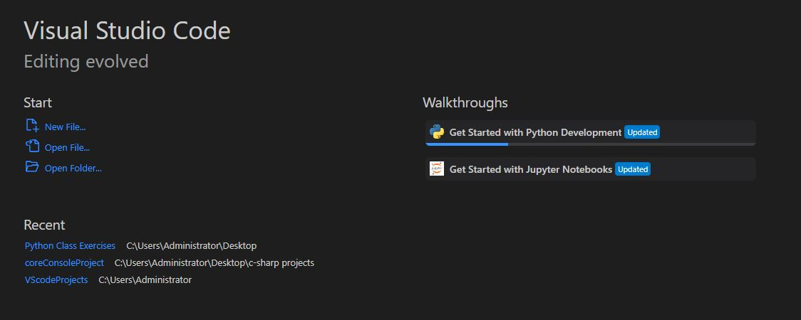
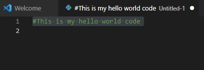
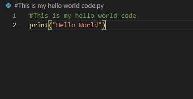
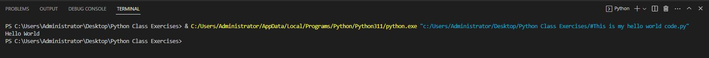

<h1>JBloom - Hello World Lab Lab</h1>

<h2>Description</h2>
In this project we will create the obligitory "hello world" code using python.
<br />


<h2>Project Walkthrough:</h2>


<b>The first thing we need to do is select a code editor. You can always just write your code using notepad but there are so many better options out there. A few that come to mind are: </b>

 - <b>VS Code</b>
 - <b>Sublime Text</b>
 - <b>ATOM</b>
 - <b>PyCharm</b>

 <b>I will be using VS code for this lab.<b>
 
 <h2>Set Up a File:</h2>
 <b>We need to start a fresh file to write our code in. After opening VS code you should see an option to create a new file as seen in the picture below. Click that button and select "python file" from the options if it is listed. If it is not losted you can always add the .py extension to the file later. </b>

  
 


 <h2>Creating A Comment</h2>
 <b>Comments are commonly used to give additional informtaion to people who are not the original author when debugging code. We will just add a sinple introduction here. To make a comment in python all you need to do is put a hashtag at the beginning of a line and then type out your comment. Belo is a picture of my comment.<b/>

 

  <h2>The Print Function()</h2>
  <b> To make the terminal display what we want it to we can use the print() function. anything you want to be displayed in the terminal you sinply type inside of the parentheses but do not forget the quotation marks or your script will not run. In this case we will type print("Hello World"). </b>

   

<h2>Run The Code</h2>

<b>At this point the code is ready to run. All you need to do is save the file and click the run button. If done correctly the terminal will display the correct message. Below is a picture of my terminal after running the code. you can see it printed in the middle line.</b>



<h2>Conclusion</h2>

<b>That wraps up the project! Hopefully you have enjoyed it! </b>

</p>

<!--
 ```diff
- text in red
+ text in green
! text in orange
# text in gray
@@ text in purple (and bold)@@
```
--!>
